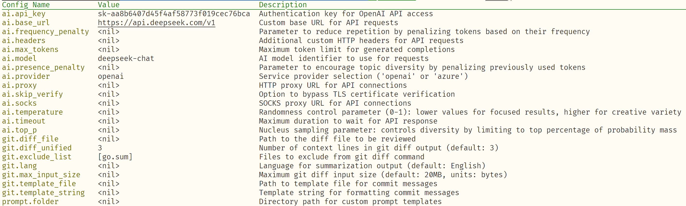

## 安装方式
可以从[Release](https://github.com/loveRyujin/ReviewBot/Release)下载预编译的二进制文件，将其放置路径加入环境变量。
执行以下命令：
```sh
reviewbot
```  

输出以下内容，代表安装成功：
```
help code review when merging code

Usage:
  reviewbot [command]

Available Commands:
  commit      Automically generate commit message
  config      Manage configuration settings
  help        Help about any command
  review      Auto review code changes in git stage

Flags:
  -c, --config string   config file path
  -h, --help            help for reviewbot

Use "reviewbot [command] --help" for more information about a command.
```  

从源码安装(需要go版本为1.24.0以上)：
```sh
go install github.com/loveRyujin/ReviewBot/cmd/reviewbot@latest
```

## 功能
- 帮助生成git commit message（遵循conventional commits规范）
- 帮助进行code review，针对代码变更生成对应的建议
- 支持自定义git diff生成的差异上下文行数
- 支持选择让git diff忽略的文件
- 支持proxy配置

## 使用方法
### 配置方法
- 命令行参数（可用 -h | --help 对对应命令的命令行参数进行查看）
- 环境变量（以REVIEWBOT为前缀，_进行拼接，如REVIEWBOT_AI_BASE_URL,对应ai.base_url这个配置项）
- yaml配置文件（会从三个地方读取配置：~/.config/reviwebot/reviewbot.yaml、项目根目录、根目录下的config目录，优先级按照顺序从低到高）

### 生成git commit message
```sh
git add .
reviewbot commit
```
  
### 进行code review
```sh
git add .
reviewbot review
```

### 列出可选配置
```sh
reviewbot config list
```
可选配置如下:  




### 更新配置
```sh
reviewbot config set ai.api_key xxxxxx
```
更新成功输出类似下面：

