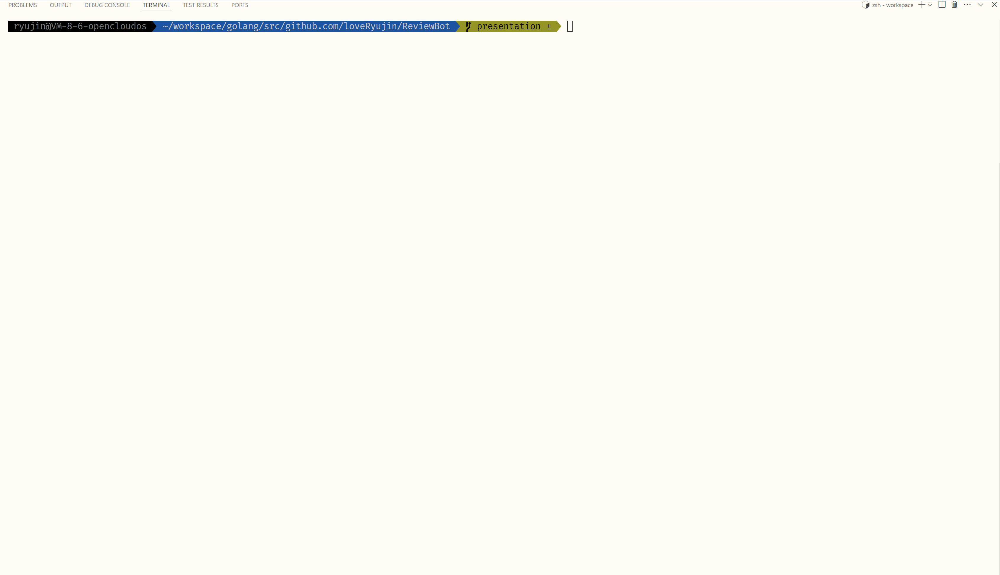
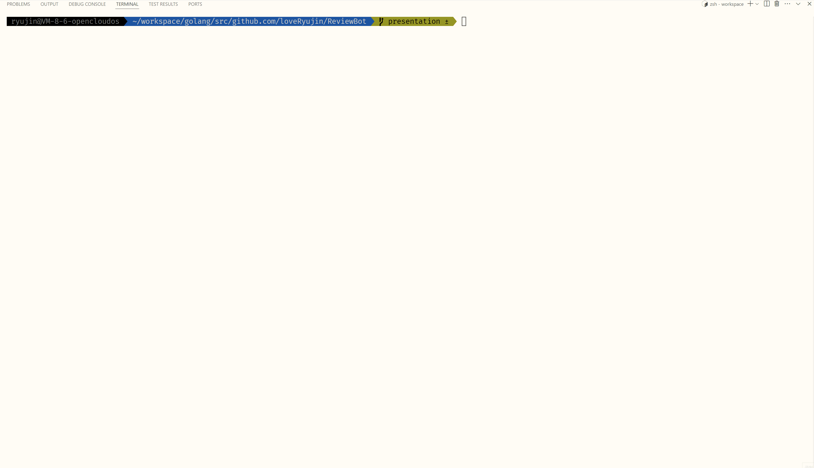

## 安装方式
可以从[Release](https://github.com/loveRyujin/ReviewBot/releases)下载预编译的二进制文件，将其放置路径加入环境变量。
执行以下命令：
```sh
reviewbot
```  

输出以下内容，代表安装成功：
```
help code review when merging code

Usage:
  reviewbot [command]

Available Commands:
  commit      Automically generate commit message
  config      Manage configuration settings
  help        Help about any command
  review      Auto review code changes in git stage

Flags:
  -c, --config string   config file path
  -h, --help            help for reviewbot

Use "reviewbot [command] --help" for more information about a command.
```  

从源码安装（需要go version为1.24.0以上）：
```sh
go install github.com/loveRyujin/ReviewBot/cmd/reviewbot@latest
```

下载源码编译（go version同上）：
```sh
git clone https://github.com/loveRyujin/ReviewBot.git
make build
```
同时支持编译不同平台的二进制文件，具体参考Makefile。

## 功能
- 帮助生成git commit message（遵循conventional commits规范）
- 帮助进行code review，针对代码变更生成对应的建议
- 支持输出指定翻译语言
- 支持流式输出
- 支持外部输入git diff信息（标准输入、文件、命令行参数）
- 支持自定义git diff生成的差异上下文行数
- 支持选择让git diff忽略的文件
- 支持proxy配置
- 支持替换base_url
- 支持请求大模型的超时配置

## 使用方法
### 配置方法
- 命令行参数（可用 -h | --help 对对应命令的命令行参数进行查看）
- 环境变量（以REVIEWBOT为前缀，_进行拼接，如REVIEWBOT_AI_BASE_URL,对应ai.base_url这个配置项）
- yaml配置文件（会从三个地方读取配置：~/.config/reviwebot/reviewbot.yaml、项目根目录、根目录下的config目录，优先级按照顺序从低到高）

### 查看版本
展示语义化版本：
```sh
reviewbot --version
```
展示详细版本信息：
```sh
reviewbot --version=raw
```
### 生成git commit message
```sh
git add .
reviewbot commit
```

  
### 进行code review
```sh
git add .
reviewbot review
```


### 列出可选配置
```sh
reviewbot config list
```
可选配置如下:  


### 更新配置
```sh
reviewbot config set ai.api_key xxxxxx
```
更新成功输出类似下面：


### 流式输出（review命令支持）
指定 --stream=true
```sh
reviewbot review --stream=true
```

### 指定语言翻译（review命令支持）
指定 --output_lang=lang，支持（en、zh-cn、zh-tw、jp）  

```sh
reviewbot review --output_lang=zh-cn
```

### 从外部源获取git diff
指定 --mode=external  

- 标准输入（管道、重定向）
```sh
git add .
git diff --staged | reviewbot review --mode=external
```

- 文件
```sh
git add .
git diff --staged > git_diff.txt
reviewbot review --mode=external --diff_file=git_diff.txt
```

- 命令行参数
```sh
reviewbot review --mode=external your_git_diff_content
```


## 其它
目前支持访问openai和deepseek。国内因为某种原因无法直接访问openai的服务，可以参考该项目config目录下的reviewbot.yaml在对应路径进行配置，访问deepseek的服务，或者自己配置proxy.proxy_url。