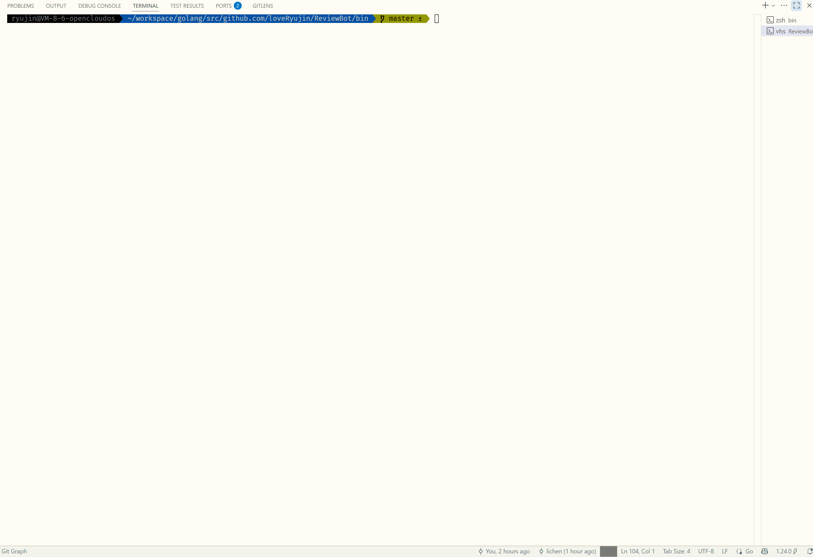
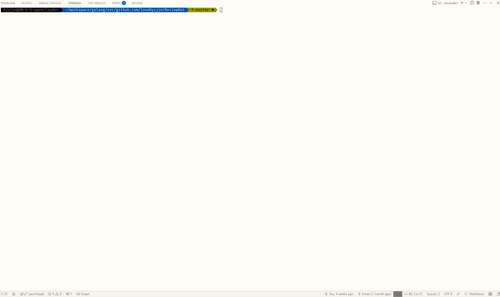
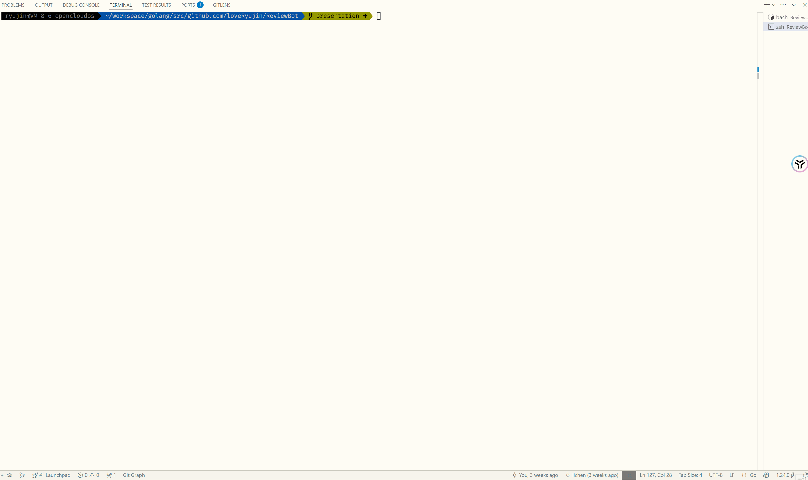
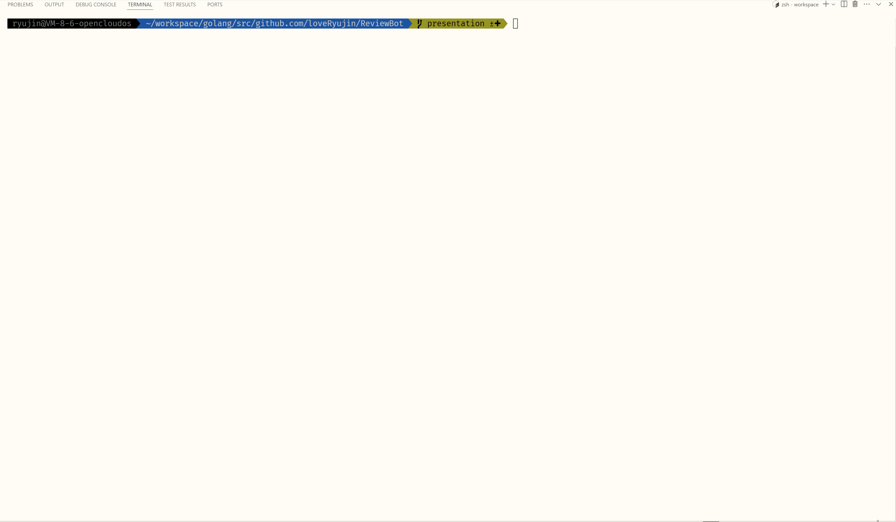
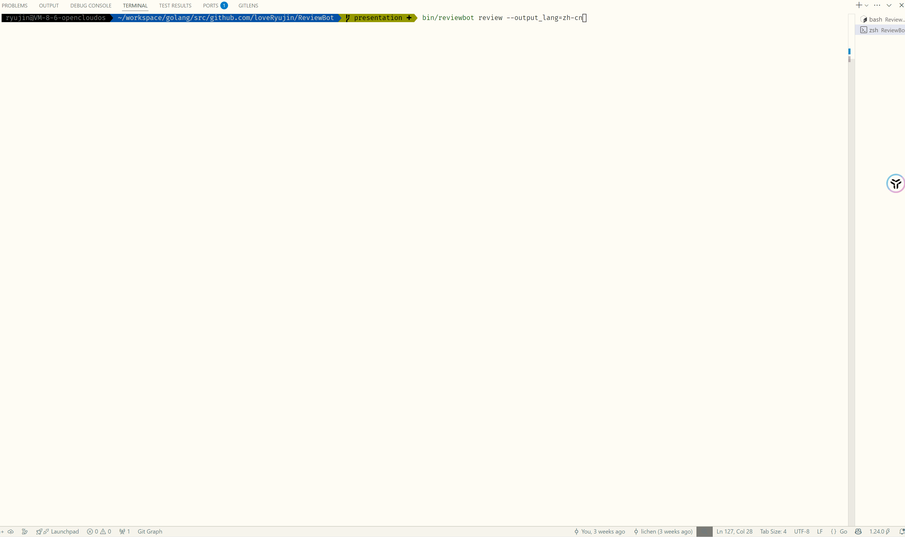

# ReviewBot

[](https://github.com/loveRyujin/ReviewBot/actions/workflows/test.yml)
[](https://codecov.io/gh/loveRyujin/ReviewBot)
[](https://goreportcard.com/report/github.com/loveRyujin/ReviewBot)
[](https://opensource.org/licenses/MIT)
[](https://github.com/loveRyujin/ReviewBot)
[](https://github.com/loveRyujin/ReviewBot/releases)
[](https://deepwiki.com/loveRyujin/ReviewBot)

English | [简体中文](./README_zh-cn.md)

An AI-powered command-line tool that helps developers generate commit messages, perform code reviews, and streamline daily development tasks based on Git repository changes.

## Installation

- **Download Pre-built Binaries**: Get the latest release from [Releases](https://github.com/loveRyujin/ReviewBot/releases) and add the directory to your `PATH`.
- **Build from Source** (requires Go >= 1.24.0):
  ```sh
  git clone https://github.com/loveRyujin/ReviewBot.git
  cd ReviewBot
  make install
  ```
  The `make install` command will compile and install the executable to `GOBIN` (or `GOPATH/bin`). If you only want to build the binary in the repository, run `make build`, which places the executable at `bin/reviewbot` (`bin/reviewbot.exe` on Windows).

To verify the installation:
```sh
reviewbot --help
```
You should see the following output:
```
  ____                   _                     ____            _
 |  _ \    ___  __   __ (_)   ___  __      __ | __ )    ___   | _
 | |_) |  / _ \ \ \ / / | |  / _ \ \ \ /\ / / |  _ \   / _ \  | __|
 |  _ <  |  __/  \ V /  | | |  __/  \ V  V /  | |_) | | (_) | | _
 |_| \_\  \___|   \_/   |_|  \___|   \_/\_/   |____/   \___/   \__|

A command-line tool that helps generate git commit messages, code reviews, etc.

Usage:
  reviewbot [flags]
  reviewbot [command]

Available Commands:
  commit      Automically generate commit message
  config      Manage configuration settings
  help        Help about any command
  init        Initialize ReviewBot configuration
  review      Auto review code changes in git stage

Flags:
  -c, --config string            config file path
  -h, --help                     help for reviewbot
      --version version[=true]   Print version information and quit.

Use "reviewbot [command] --help" for more information about a command.
```


## Features

- Generate git commit messages following Conventional Commits specification
- Automatically review code changes and provide suggestions
- Support for multiple output languages with translation
- Stream output support for real-time feedback
- Read external git diff from stdin, file, or command-line arguments
- Customize git diff context lines
- Configure ignore file patterns
- Custom prompt template directory via configuration or environment variables
- Network configuration including proxy, base_url, and request timeout
- Flexible AI provider and model selection via configuration or command-line arguments

## Usage

### Configuration Methods

Configuration priority from lowest to highest:
- YAML configuration file (in order: `~/.config/reviewbot/reviewbot.yaml`, project root directory, `config/` directory in project root)
- Environment variables (prefixed with `REVIEWBOT_`, using `_` as separator, e.g., `REVIEWBOT_AI_BASE_URL` maps to `ai.base_url`)
- Global flags `--provider` and `--model` can override the current session's provider and model, taking precedence over configuration files and environment variables
- Command-line flags (use `-h` or `--help` to view available options for each command)

Run `reviewbot init` to set up configuration interactively. The system will generate a configuration file at the default path `~/.config/reviewbot/reviewbot.yaml`.

#### Custom Prompt Templates

To customize prompts, set `prompt.folder` in the configuration file (or use the `REVIEWBOT_PROMPT_FOLDER` environment variable). Templates in this directory will override built-in templates (keep the same filename). Currently customizable templates include:
- `code_review_file_diff.tmpl`
- `conventional_commit.tmpl`
- `summarize_file_diff.tmpl`
- `summarize_title.tmpl`
- `translation.tmpl`

All templates use Go `text/template` syntax and rely on predefined placeholders (e.g., `{{ .file_diffs }}`, `{{ .summary_points }}`, `{{ .output_language }}`).
You can copy templates from the `prompt/template/` directory to your custom directory and modify them, for example:
```text
Below is the code patch, please provide feedback:

{{ .file_diffs }}
```
As long as you maintain the placeholder names, the system will populate them with the appropriate data during prompt generation.

Common placeholder descriptions:
- `{{ .file_diffs }}`: The complete Git diff or individual file diff text
- `{{ .summary_points }}`: List of file-level summaries generated by the model, commonly used for subsequent commit message refinement
- `{{ .output_language }}`: Target output language identifier (e.g., `en`, `zh-cn`)
- `{{ .output_message }}`: Original text content to be translated

### Check Version

Display semantic version:
```sh
reviewbot --version
```
Display detailed version information:
```sh
reviewbot --version=raw
```

### Initialize Configuration

```sh
reviewbot init
```


### Generate Git Commit Message

```sh
git add .
reviewbot commit
```


Preview mode:
```sh
git add .
reviewbot commit --preview
```


### Perform Code Review

```sh
git add .
reviewbot review
```


### List Available Configuration Options

```sh
reviewbot config list
```
Configuration list display:


### Update Configuration

```sh
reviewbot config set ai.api_key xxxxxx
```
Successful update example:



### Enable Stream Output (review command)

```sh
reviewbot review --stream
```


### Specify Output Language (review & commit commands)

```sh
reviewbot review --output_lang=zh-cn
reviewbot commit --output_lang=zh-cn
```


### Get Git Diff from External Sources

Specify `--mode=external`:
- Standard input (pipe, redirection):
  ```sh
  git add .
  git diff --staged | reviewbot review --mode=external
  ```
  
- File:
  ```sh
  git add .
  git diff --staged > git_diff.txt
  reviewbot review --mode=external --diff_file=git_diff.txt
  ```
  
- Command-line arguments:
  ```sh
  reviewbot review --mode=external your_git_diff_content
  ```
  

## Additional Notes

If your network environment cannot directly access certain LLM APIs, you can configure a custom `base_url` as shown in the `config/reviewbot.yaml` example.

We recommend using [openrouter](https://openrouter.ai/).

## Roadmap

Check out [TODO.md](./TODO.md) to learn about the project's improvement plans and development roadmap. Contributions and suggestions are welcome!

## License

This project is licensed under the MIT License. See the [LICENSE](./LICENSE) file for details.

