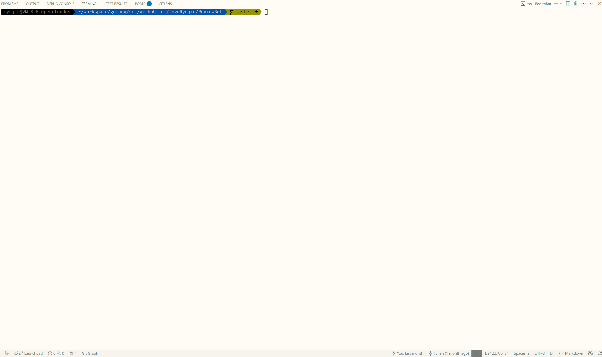

# ReviewBot

[](https://github.com/loveRyujin/ReviewBot/actions/workflows/test.yml)
[](https://codecov.io/gh/loveRyujin/ReviewBot)
[](https://goreportcard.com/report/github.com/loveRyujin/ReviewBot)
[](https://opensource.org/licenses/MIT)
[](https://github.com/loveRyujin/ReviewBot)
[](https://github.com/loveRyujin/ReviewBot/releases)
[](https://deepwiki.com/loveRyujin/ReviewBot)

一个人工智能驱动的命令行工具，根据 Git 仓库里的变更帮助开发人员生成 commit message、执行 code review 等日常工作。

## 安装方式
- **下载发布包**：从 [Release](https://github.com/loveRyujin/ReviewBot/releases) 获取预编译二进制，并将所在目录加入 `PATH`。
- **源码安装**（需要 Go >= 1.24.0）：
  ```sh
  git clone https://github.com/loveRyujin/ReviewBot.git
  cd ReviewBot
  make install
  ```
  `make install` 会编译并把可执行文件安装到 `GOBIN`（或 `GOPATH/bin`）。若只想在仓库内生成二进制，可执行 `make build`，文件会位于 `bin/reviewbot`（Windows 下为 `bin/reviewbot.exe`）。

安装后执行以下命令进行验证：
```sh
reviewbot --help
```
输出以下信息即代表安装成功：
```
  ____                   _                     ____            _
 |  _ \    ___  __   __ (_)   ___  __      __ | __ )    ___   | _
 | |_) |  / _ \ \ \ / / | |  / _ \ \ \ /\ / / |  _ \   / _ \  | __|
 |  _ <  |  __/  \ V /  | | |  __/  \ V  V /  | |_) | | (_) | | _
 |_| \_\  \___|   \_/   |_|  \___|   \_/\_/   |____/   \___/   \__|

A command-line tool that helps generate git commit messages, code reviews, etc.

Usage:
  reviewbot [flags]
  reviewbot [command]

Available Commands:
  commit      Automically generate commit message
  config      Manage configuration settings
  help        Help about any command
  init        Initialize ReviewBot configuration
  review      Auto review code changes in git stage

Flags:
  -c, --config string            config file path
  -h, --help                     help for reviewbot
      --version version[=true]   Print version information and quit.

Use "reviewbot [command] --help" for more information about a command.
```


## 功能
- 帮助生成符合 Conventional Commits 规范的 git commit message。
- 自动审查代码变更并给出建议。
- 支持输出指定翻译语言。
- 支持流式输出。
- 支持从标准输入、文件或命令行参数读取外部 git diff。
- 支持自定义 git diff 的上下文行数。
- 支持配置需要忽略的文件列表。
- 支持通过配置或环境变量指定自定义 Prompt 模板目录。
- 支持 proxy、base_url、请求超时等网络相关配置。
- 支持通过配置或命令行参数自定义 AI provider / model。

## 使用方法
### 配置方式
- 命令行参数（使用 `-h` 或 `--help` 查看各命令的参数）。
- 全局参数 、 可以在命令行覆盖当前会话的模型提供方与模型，优先级高于配置文件与环境变量。
- 环境变量（以 `REVIEWBOT` 为前缀，使用 `_` 连接，例如 `REVIEWBOT_AI_BASE_URL` 对应配置项 `ai.base_url`）。
- YAML 配置文件（按优先级从低到高依次读取：`~/.config/reviewbot/reviewbot.yaml`、项目根目录、根目录下的 `config` 目录）。
- 运行 `reviewbot init` 命令，根据引导输入配置，系统会在默认路径 `~/.config/reviewbot/reviewbot.yaml` 生成配置文件。

若需要自定义 Prompt，可在配置文件中设置 `prompt.folder`（或通过环境变量 `REVIEWBOT_PROMPT_FOLDER`），该目录中的模板会覆盖内置模板（文件名保持一致）。当前可覆盖的模板文件包括：
- `code_review_file_diff.tmpl`
- `conventional_commit.tmpl`
- `summarize_file_diff.tmpl`
- `summarize_title.tmpl`
- `translation.tmpl`

各模板使用 Go `text/template` 语法并依赖既定的占位符（如 `{{ .file_diffs }}`、`{{ .summary_points }}`、`{{ .output_language }}` 等）。
可以从 `prompt/template/` 目录复制同名文件到自定义目录后进行修改，例如：
```text
Below is the code patch, please provide feedback:

{{ .file_diffs }}
```
只需保持占位符名称不变，就能在生成提示语时按既有数据填充。
常见占位符说明：
- `{{ .file_diffs }}`：传入的完整 Git diff 或单个文件 diff 文本。
- `{{ .summary_points }}`：模型生成的文件级摘要列表，常用于后续提炼 commit 信息。
- `{{ .output_language }}`：目标输出语言标识（例如 `en`、`zh-cn`）。
- `{{ .output_message }}`：待翻译的原始文本内容。

### 查看版本
展示语义化版本：
```sh
reviewbot --version
```
展示详细版本信息：
```sh
reviewbot --version=raw
```

### 初始化配置
```sh
reviewbot init
```


### 生成 git commit message
```sh
git add .
reviewbot commit
```


```sh
git add .
reviewbot commit --preview
```


### 进行 code review
```sh
git add .
reviewbot review
```


### 列出可选配置
```sh
reviewbot config list
```
可选配置展示：


### 更新配置
```sh
reviewbot config set ai.api_key xxxxxx
```
更新成功示例：


### 启用流式输出（review 命令支持）
```sh
reviewbot review --stream
```


### 指定输出语言（review、commit 命令支持）
```sh
reviewbot review --output_lang=zh-cn
reviewbot commit --output_lang=zh-cn
```


### 从外部来源获取 git diff
指定 `--mode=external`：
- 标准输入（管道、重定向）：
  ```sh
  git add .
  git diff --staged | reviewbot review --mode=external
  ```
  
- 文件：
  ```sh
  git add .
  git diff --staged > git_diff.txt
  reviewbot review --mode=external --diff_file=git_diff.txt
  ```
  
- 命令行参数：
  ```sh
  reviewbot review --mode=external your_git_diff_content
  ```
  

## 其它
如果网络环境无法直接访问某些大模型的 API，可参考 `config/reviewbot.yaml` 的示例，在对应路径配置自定义 `base_url`。

推荐使用 [openrouter](https://openrouter.ai/)。

## 项目改进计划
查看 [TODO.md](./TODO.md) 了解项目的改进计划和开发路线图。欢迎贡献代码或提出建议！

## 许可证
本项目采用 MIT 许可证。详情请查看 [LICENSE](./LICENSE) 文件。
